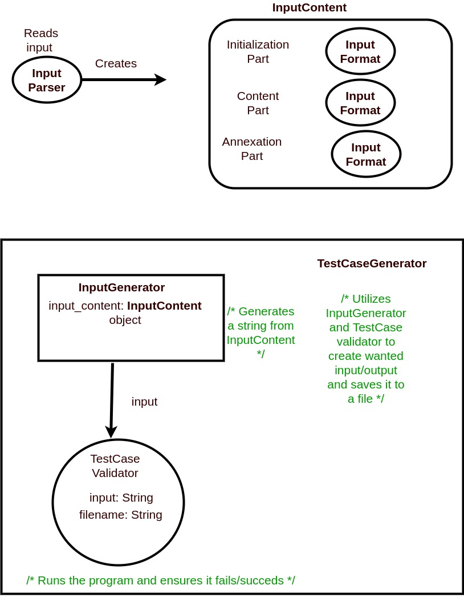

# Test Generator
This tool is used to easily generate tests for different kinds of programming challenges, requiring a variety of input.
It is still in an early stage and probably not usable for most challenges, especially more intricate ones.

As most tests will be generated against the python's timeout (5 seconds), we will need to adjust other languages' timeouts to accomodate that.
(it is really unrealistic to test with every language)

The current class diagram:
